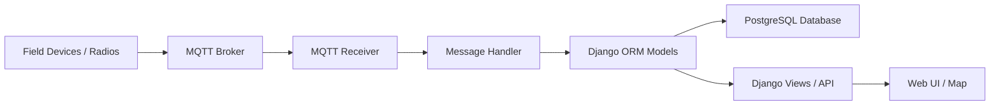

# MARS-EVALINK Architecture Overview

## Summary

MARS-EVALINK is a Django-based monitoring and mapping application for field stations. It receives device data over MQTT, stores it in a PostgreSQL database, and exposes it through web endpoints and a map-based user interface.

## Main Components

### 1. Web application layer
- The application is built with Django, with the main project configuration in [evalink/evalink/settings.py](../evalink/evalink/settings.py) and routing in [evalink/evalink/urls.py](../evalink/evalink/urls.py).
- It serves the web UI, admin interface, authentication, and several JSON/GeoJSON endpoints used by the frontend.

### 2. Domain model
- The core data model is defined in [evalink/evalink/models.py](../evalink/evalink/models.py).
- It represents stations, hardware, position logs, telemetry logs, text messages, campuses, geofences, vehicles, crews, EVA-related records, and aircraft/APRS data.

### 3. Data ingestion pipeline
- Incoming messages are received through MQTT in [evalink/evalink/mqtt.py](../evalink/evalink/mqtt.py).
- The message handler in [evalink/evalink/handler.py](../evalink/evalink/handler.py) transforms those messages into Django model records.
- This pipeline handles:
  - position reports,
  - telemetry updates,
  - text messages,
  - and ADS-B aircraft observations.

### 4. API and presentation layer
- The view layer in [evalink/evalink/views.py](../evalink/evalink/views.py) exposes endpoints for features, paths, text logs, inventory, search, chat, statistics, and related operational data.
- These endpoints provide the structured data needed by the map interface.

### 5. Persistence and deployment
- The system uses PostgreSQL as its main database, configured in [evalink/evalink/settings.py](../evalink/evalink/settings.py).
- The deployment model described in [README.md](../README.md) assumes a typical Django web stack with a web server and WSGI entry point.

## High-level flow

1. Devices send telemetry and position updates over MQTT.
2. The MQTT subscriber receives the messages.
3. The handler parses and validates the payloads.
4. The data is stored in PostgreSQL using the Django ORM.
5. Web endpoints read from the database and serve the information to the UI.

## Simple component diagram

## In one sentence

MARS-EVALINK is a Django + PostgreSQL system that ingests station and environmental data from MQTT, persists it in a structured data model, and exposes it through a web-based map and operational dashboard.
