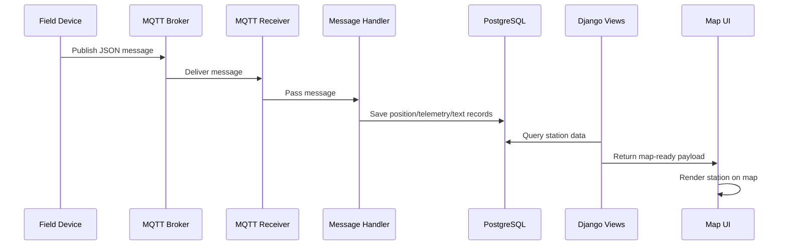

# Example Data Flow: From Sensor Message to the Map

This document walks through a typical example of how a station message moves through the MARS-EVALINK system and ends up visible on the map.

## 1. A device publishes a message
A field station or radio sends a JSON message over MQTT. The payload typically includes fields such as:
- `type` (for example, `position`, `telemetry`, or `text`)
- `payload`
- `timestamp`
- `from` (the sender or hardware number)

This is received by the MQTT listener in [evalink/evalink/mqtt.py](../evalink/evalink/mqtt.py).

## 2. The MQTT layer validates the message
The MQTT receiver checks that the incoming payload includes the expected fields. If the message is valid, it passes it to the message handler in [evalink/evalink/handler.py](../evalink/evalink/handler.py).

## 3. The handler resolves the station
The handler looks up the corresponding station using the sender hardware number.
- If the station is new, it creates a new station record.
- If the station already exists, it updates the existing record.

This logic is implemented in [evalink/evalink/handler.py](../evalink/evalink/handler.py).

## 4. The payload is converted into domain records
For a position update:
- the coordinates are converted into decimal latitude and longitude,
- a new position log is created,
- and the station’s current location is updated.

For telemetry or text messages:
- telemetry logs or text logs are created,
- and the station’s feature data is updated.

These records are defined by the Django models in [evalink/evalink/models.py](../evalink/evalink/models.py).

## 5. The data is persisted in PostgreSQL
The Django ORM saves the new records into the PostgreSQL database configured in [evalink/evalink/settings.py](../evalink/evalink/settings.py).

## 6. The web layer exposes the data
The view layer in [evalink/evalink/views.py](../evalink/evalink/views.py) queries the database and prepares the data for the frontend.

Typical endpoints include:
- feature data for map markers and geometry
- path data for station movement history
- text logs and related metadata

## 7. The map UI renders the information
The frontend consumes the generated API responses and displays:
- station positions,
- paths/tracks,
- text messages,
- and telemetry-related details.

## End-to-end summary
The flow is:

MQTT message → message handler → Django models → PostgreSQL → views/API → map UI

## Short sequence diagram

