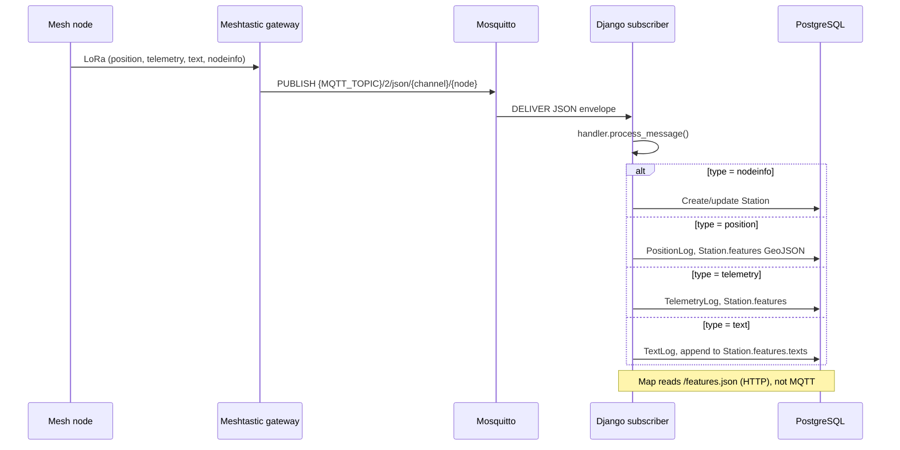
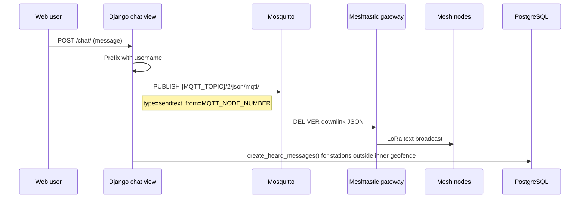
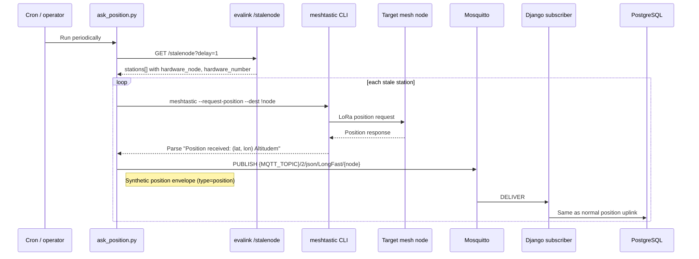
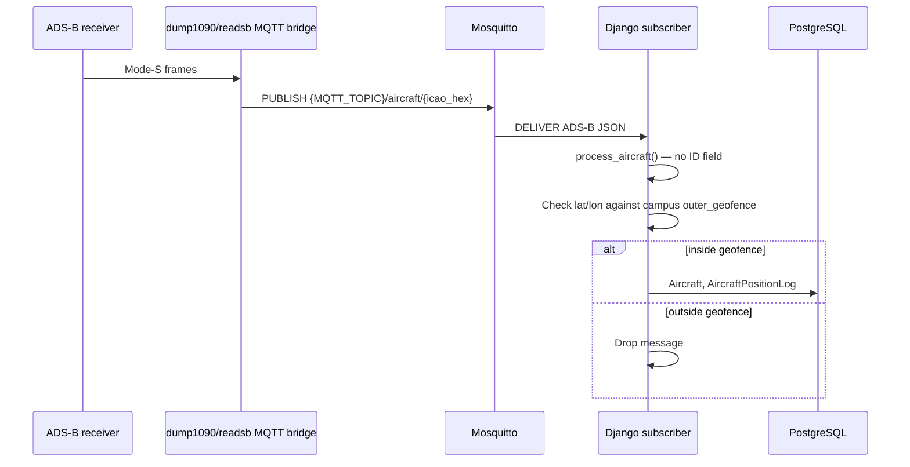
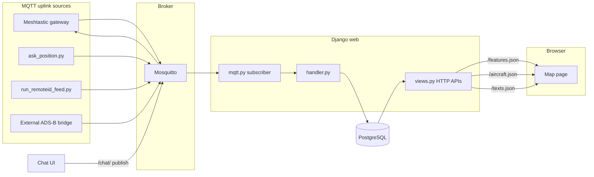

# MQTT Flows in evalink

This document describes how MQTT is used across the mars-evalink project: the broker topology, topic layout, publishers, subscribers, and what happens to each message in Django.

## Overview

evalink uses MQTT as a bus between field hardware (Meshtastic mesh gateways, ESP32 RemoteID listeners) and the Django web application. The Django process is both an **MQTT subscriber** (started at import time) and an **MQTT publisher** (for mesh downlink chat).

```
              Internet
                 |
    +------------+------------+
    |                         |
  Cloudflare              Cloudflare
  (HTTPS proxy)           Spectrum
  :443                    (TLS :8883)
    |                         |
    | plain HTTP              | plain MQTT
    v                         v
+--------+               +--------+
|  web   |<------------>|  mqtt  |     Docker compose / ZimaOS
| Django |  evalink     |Mosquitto|
|+subscr.|  network     +--------+
+--------+                    ^
    |                         |
    v                         |
+--------+                    |
|   db   |                    |
|Postgres|                    |
+--------+                    |
                              |
         External publishers --+
         (Meshtastic gateway, run_remoteid_feed, ask_position)
```

The web container runs Gunicorn **and** the MQTT subscriber thread (`evalink/__init__.py` calls `mqtt.client.loop_start()`). Tests disable this via `MQTT_ENABLED = False` in `evalink/test_settings.py`.

## Configuration

| Variable | Role |
|----------|------|
| `MQTT_SERVER` | Broker hostname (`mqtt` inside compose, `localhost` on bare metal) |
| `MQTT_PORT` | Broker port (default `1883`) |
| `MQTT_USER` / `MQTT_PASSWORD` | Required broker credentials |
| `MQTT_TLS` | Non-empty enables TLS on the **client** side (Spectrum terminates TLS publicly) |
| `MQTT_TOPIC` | Topic root, e.g. `msh/MarsSociety/MDRS` |
| `MQTT_NODE_NUMBER` | Numeric Meshtastic node ID of the campus gateway; used as `from` on downlink chat and excluded from stale-node queries |
| `MQTT_JSON_BRIDGE_SEG` | Bridge segment in uplink topics (default `2`; used by `ask_position.py`) |
| `MQTT_JSON_CHANNEL` | Channel name in uplink topics (default `LongFast`; used by `ask_position.py`) |
| `CAMPUS` | Campus name in the database; scopes mesh processing and RemoteID aircraft routing |

Broker auth is enforced in `mosquitto/config/mosquitto.conf` (`allow_anonymous false`). The container entrypoint regenerates the password file from env on every boot.

## Topic Taxonomy

| Topic pattern | Direction | Typical publisher | Subscriber |
|---------------|-----------|-------------------|------------|
| `{MQTT_TOPIC}/+/json/#` | Uplink (mesh -> cloud) | Meshtastic gateway, `ask_position.py` | Django `mqtt.py` |
| `{MQTT_TOPIC}/2/json/mqtt/` | Downlink (cloud -> mesh) | Django `chat` view | Meshtastic gateway |
| `{MQTT_TOPIC}/aircraft/{hex}` | Uplink (aircraft/drones) | `run_remoteid_feed.py`, external ADS-B bridge | Django `mqtt.py` |

The `+` wildcard matches the gateway bridge node segment (conventionally `2` in this deployment). Uplink JSON topics follow Meshtastic MQTT layout:

```
{MQTT_TOPIC}/{bridge_node}/json/{channel_name}/{destination_node}
```

Downlink uses a fixed topic ending in `/json/mqtt/` (Meshtastic downlink channel).

## Central Subscriber

Implementation: `evalink/evalink/mqtt.py`

On connect, the client subscribes to both uplink patterns:

```python
client.subscribe(f'{MQTT_TOPIC}/+/json/#')
client.subscribe(f'{MQTT_TOPIC}/aircraft/+')
```

`on_message` routes by topic prefix:

1. **Aircraft topics** -> `handler.process_aircraft(hex_code, message)`
2. **JSON mesh topics** -> validate envelope (`type`, `payload`, `timestamp`, `from`) -> `handler.process_message(message)`

All persistence logic lives in `evalink/evalink/handler.py`.

---

## Flow 1: Meshtastic mesh uplink

Field mesh nodes report through a campus gateway that bridges LoRa traffic to MQTT.



### Message envelope (mesh uplink)

Required top-level fields:

```json
{
  "type": "position | telemetry | text | nodeinfo",
  "payload": { },
  "from": 3663164608,
  "timestamp": 1710000000,
  "id": 123456789,
  "channel": 0
}
```

### Handler behavior by type

| `type` | DB writes | Notes |
|--------|-----------|-------|
| `nodeinfo` | `Station` (auto-create if unknown hardware) | Creates `Hardware` / `StationProfile` if missing |
| `position` | `PositionLog`, `StationMeasure`, `Station.features` | Skips 0,0 coords; geofence-aware logging |
| `telemetry` | `TelemetryLog`, `StationMeasure` | Deduped by `message_id` |
| `text` | `TextLog`, `StationMeasure` | Mesh text messages |

Messages from unknown stations (no prior `nodeinfo`) are dropped except `nodeinfo` itself.

---

## Flow 2: Web chat downlink

Authenticated users send mesh text from the `/chat/` UI. Django publishes a downlink envelope; the gateway transmits it on the mesh.



### Downlink message format

```json
{
  "type": "sendtext",
  "channel": 0,
  "from": 3663164608,
  "payload": "username: hello from evalink"
}
```

`MQTT_NODE_NUMBER` must match the gateway node's numeric ID. Stations with `station_type` of `infrastructure` or `ignore`, and the gateway itself, are excluded from synthetic "heard:" log entries.

---

## Flow 3: Stale position polling (`ask_position.py`)

When mesh nodes stop reporting position while still in the field, an external cron job can poll them via the Meshtastic CLI and inject position packets back onto the uplink bus.



The `/stalenode` endpoint (no auth) returns MQTT-oriented metadata including `mqtt_downlink_topic` and `gateway_node_number`, but `ask_position.py` only uses the station list and publishes uplink position packets itself.

Stale selection criteria:

- Has a `last_position`
- Last update older than `delay` minutes
- Seen within the last 6 hours
- Outside campus **inner** geofence, inside **outer** geofence (if configured)
- Not infrastructure, ignore, or the gateway node

---

## Flow 4: RemoteID drone feed

An ESP32-S3 on a Pi or field laptop reads RemoteID serial JSON and publishes to the aircraft topic tree.

```mermaid
sequenceDiagram
    participant ESP as ESP32-S3 RemoteID
    participant Feed as run_remoteid_feed.py
    participant Broker as Mosquitto
    participant Django as Django subscriber
    participant DB as PostgreSQL
    participant Map as Web map

    ESP->>Feed: Serial JSON lines (115200 baud)
    Feed->>Feed: Validate ID, lat/lon; add source=remoteid
    Feed->>Broker: PUBLISH {MQTT_TOPIC}/aircraft/{HEX}
    Broker->>Django: DELIVER
    Django->>Django: process_aircraft() — RemoteID path (ID field present)
    Django->>DB: Aircraft, AircraftPositionLog (CAMPUS env)
    Map->>Django: GET /aircraft.json (poll every 10s)
    Django-->>Map: Latest aircraft positions
```

Example RemoteID payload (from firmware):

```json
{
  "ID": "18656A000A46",
  "lat": 38.406,
  "long": -110.792,
  "alt": 1377.0,
  "iso": "2028-01-15T05:09:52Z",
  "packet_hex": "..."
}
```

Published topic: `{MQTT_TOPIC}/aircraft/18656A000A46` with `"source": "remoteid"` added.

RemoteID routing uses the `CAMPUS` environment variable directly (not geofence). Altitude is already in meters.

---

## Flow 5: ADS-B aircraft feed (external publisher)

The same aircraft topic prefix supports dump1090/readsb-style ADS-B JSON from an external MQTT bridge (not shipped in this repo).



ADS-B altitudes (`alt_baro`, `alt_geom`) are converted from feet to meters. Position deduplication uses a per-aircraft, per-lat/lon, per-minute unique constraint on `AircraftPositionLog`.

---

## End-to-end data paths

How MQTT data reaches the map UI:



Mesh station markers and telemetry come from `/features.json`. Aircraft overlays come from `/aircraft.json` (fed by MQTT, served over HTTP). Chat downlink is the only MQTT **publish** path inside Django.

---

## Component reference

| Component | File | MQTT role |
|-----------|------|-----------|
| Subscriber + router | `evalink/evalink/mqtt.py` | Subscribe, parse, dispatch |
| Message persistence | `evalink/evalink/handler.py` | `process_message`, `process_aircraft` |
| Subscriber startup | `evalink/evalink/__init__.py` | `loop_start()` on import |
| Chat downlink | `evalink/evalink/views.py` (`chat`) | Publish `sendtext` |
| Stale node API | `evalink/evalink/views.py` (`stalenode`) | HTTP only; informs `ask_position.py` |
| Position poll script | `ask_position.py` | Publish synthetic positions |
| RemoteID script | `run_remoteid_feed.py` | Publish aircraft topics |
| Broker config | `mosquitto/config/mosquitto.conf` | Auth, listener |
| Compose stack | `docker-compose.yml` | `mqtt`, `web`, `db` services |
| Test mock | `evalink/evalink/test_mqtt_utils.py` | Mock client for unit tests |

## Related non-MQTT paths

These integrations are **not** on the MQTT bus but appear alongside it in deployments:

- **APRS** — `run_aprs_feed` management command; HTTP `/aprs.json`
- **Speech** — `speech/read_messages_tcp.py` uses Meshtastic pub/sub locally, not MQTT

See `evalink/evalink.mmd` and `v2.md` for broader field hardware topology (Pi, mesh, radios, drones).
